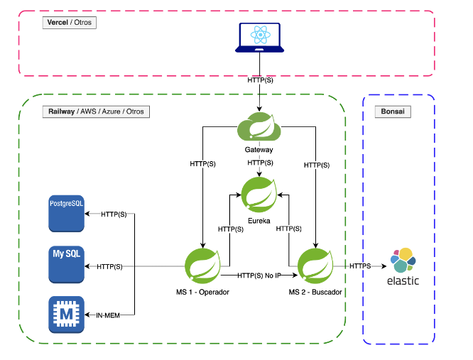

# 🛠️ Backend BookVerse (Arquitectura basada en microservicios con Docker)

Este repositorio contiene el backend de la aplicación **BookVerse**, desarrollado usando una arquitectura de microservicios basada en **Java + Spring Boot**, contenedores Docker y servicios como **Eureka**, **Cloud Gateway**, y dos microservicios funcionales: uno para catálogo de libros y otro para pagos.

Todo el sistema está orquestado con `docker-compose` para facilitar el despliegue.

---

## 📐 Arquitectura del sistema



Todos los servicios se comunican mediante nombres definidos en `docker-compose`, y están registrados automáticamente en **Eureka**.

---

## 🐳 Servicios Docker

- `eureka-server` → Registro de microservicios
- `cloud-gateway` → Punto de entrada API
- `ms-books-catalogue` → Gestión de libros
- `ms-books-payments` → Gestión de compras
- `db-catalogue` → Base de datos relacional para catálogo (PostgreSQL o MySQL)
- `db-payments` → Base de datos para pagos
- (opcional) `pgadmin` o `adminer` → Visualizador de base de datos

---

## ▶️ Cómo ejecutar el backend con Docker

1. Clona el repositorio:

```bash
git clone https://github.com/DanielRuiz96/Backend_BookVerse.git
cd Backend_BookVerse
docker-compose up --build

```

## 🌐 Accede a los servicios en tu navegador

- 🔎 **Eureka Dashboard**: [http://localhost:8761](http://localhost:8761)
- 🚪 **Cloud Gateway**: [http://localhost:8080](http://localhost:8080)Ejemplos:
  - `GET /catalogue/books`
  - `POST /payments`
- 🐘 **PostgreSQL**: configurado internamente para cada microservicio
  Puedes acceder a él con herramientas como **pgAdmin** o **Adminer** si lo agregas como servicio en `docker-compose`.

---

📌 Microservicio `ms-books-catalogue`

Permite buscar libros por los siguientes campos:

- Título
- Autor
- ISBN
- Categoría
- Fecha de publicación
- Valoración (de 1 a 5)
- Visibilidad (libros ocultos no se muestran)

### Endpoints disponibles:

- `GET /books`
- `GET /books/{id}`
- `POST /books`
- `PUT /books/{id}`
- `PATCH /books/{id}`
- `DELETE /books/{id}`
- `GET /books/search?...` (búsqueda combinada por atributos)

## 💳 Microservicio `ms-books-payments`

Se encarga de registrar compras verificando primero los libros con el catálogo.

### Validaciones previas:

- El libro existe
- Tiene stock
- Está visible

### Endpoints disponibles:

- `POST /payments`
- `GET /payments`
- `GET /payments/{id}`

---

## 🧪 Pruebas

Puedes usar herramientas como:

- **Postman**
- **Swagger UI** (si lo tienes habilitado en los microservicios)

> ⚠️ Todas las llamadas deben hacerse **a través del Cloud Gateway** en `http://localhost:8080`.

---

## 🐘 Bases de datos

- 📘 **Catálogo**: usa PostgreSQL o H2, según tu configuración en `docker-compose`.
- 💰 **Pagos**: usa PostgreSQL o MySQL.

Se usa archivos `.sql` para precargar datos de ejemplo durante el desarrollo o pruebas.
